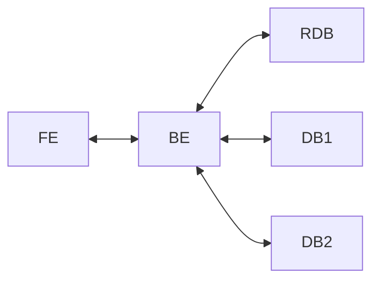
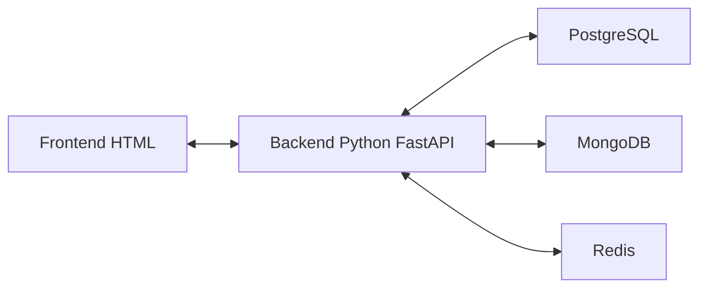

# Loja Virtual de Cosméticos - Polyglot Persistence

Este projeto é um sistema simples de loja virtual de cosméticos feito em **Python**, usando **FastAPI** no backend e três bancos de dados diferentes:

- **PostgreSQL**: banco relacional;
- **MongoDB**: banco NoSQL orientado a documentos;
- **Redis**: sistema de cache.

A ideia do projeto é mostrar o conceito de **Polyglot Persistence**, ou seja, usar mais de um tipo de banco de dados no mesmo sistema, escolhendo cada banco de acordo com o tipo de dado e a forma como a aplicação usa esses dados.

---

## 1. Tema escolhido

O tema escolhido foi uma **loja virtual de cosméticos**.

O sistema permite:

- cadastrar, listar, editar e excluir clientes;
- cadastrar, listar, editar e excluir produtos de cosméticos;
- criar, listar, atualizar e excluir pedidos;
- usar cache para acelerar consultas de produtos.

Esse tema foi escolhido porque uma loja virtual tem dados de tipos diferentes. Alguns dados são mais estruturados, como cliente e pedido, enquanto outros são mais flexíveis, como produto, ingredientes, tipo de pele e descrição.

---

## 2. Arquitetura do projeto

Modelo pedido no enunciado:



Aplicando no projeto:



---

## 3. Justificativa dos bancos usados

### PostgreSQL - banco relacional

O PostgreSQL foi usado para armazenar:

- clientes;
- pedidos.

Motivo da escolha:

Clientes e pedidos possuem dados bem estruturados e com relacionamento entre si. Por exemplo, um pedido pertence a um cliente. Por isso, faz sentido usar um banco relacional, com tabelas, chave primária e chave estrangeira.

Tabelas criadas:

- `clientes`
- `pedidos`

---

### MongoDB - banco NoSQL orientado a documentos

O MongoDB foi usado para armazenar:

- produtos/cosméticos.

Motivo da escolha:

Produtos de cosméticos podem ter informações variadas. Um produto pode ter ingredientes, tipo de pele, descrição, categoria, marca etc. Como esses dados podem mudar bastante de um produto para outro, o MongoDB é uma boa escolha porque armazena documentos flexíveis em formato parecido com JSON.

Coleção criada:

- `produtos`

---

### Redis - sistema de cache

O Redis foi usado para armazenar temporariamente:

- lista de produtos;
- produto consultado por ID.

Motivo da escolha:

Produtos costumam ser muito consultados em uma loja virtual. Para evitar buscar no MongoDB toda hora, o Redis guarda o resultado por alguns segundos. Assim, a segunda consulta fica mais rápida.

Chaves usadas no Redis:

- `produtos:todos`
- `produto:{id_do_produto}`

---

## 4. Tecnologias usadas

- Python 3.11 ou superior;
- FastAPI;
- Uvicorn;
- PostgreSQL;
- MongoDB;
- Redis;
- Docker;
- Docker Compose;
- HTML, CSS e JavaScript simples para o frontend.

---

## 5. Estrutura dos arquivos

```text
loja_cosmeticos_polyglot/
│
├── app/
│   ├── __init__.py
│   ├── database.py
│   ├── main.py
│   ├── models.py
│   └── seed.py
│
├── frontend/
│   └── index.html
│
├── docker-compose.yml
├── requirements.txt
├── .env.example
└── README.md
```

Explicando de forma simples:

- `app/main.py`: arquivo principal do backend. É onde ficam as rotas da API.
- `app/database.py`: faz a conexão com PostgreSQL, MongoDB e Redis.
- `app/models.py`: define os formatos dos dados enviados para a API.
- `app/seed.py`: insere dados iniciais de teste.
- `frontend/index.html`: tela simples para testar o sistema pelo navegador.
- `docker-compose.yml`: sobe os três bancos de dados com Docker.
- `requirements.txt`: lista os pacotes Python necessários.
- `.env.example`: exemplo das configurações de conexão com os bancos.
- `README.md`: explicação e instruções do projeto.

---

## 6. Como rodar o projeto

### Passo 1 - Instalar programas necessários

Você precisa ter instalado:

- Python;
- Docker Desktop;
- Git, se for subir para o GitHub.

---

### Passo 2 - Abrir a pasta do projeto

Entre na pasta do projeto pelo terminal:

```bash
cd loja_cosmeticos_polyglot
```

---

### Passo 3 - Subir os bancos com Docker

Rode:

```bash
docker compose up -d
```

Isso vai iniciar:

- PostgreSQL na porta `5432`;
- MongoDB na porta `27017`;
- Redis na porta `6379`.

Para verificar se os containers subiram:

```bash
docker ps
```

---

### Passo 4 - Criar ambiente virtual Python

No Windows:

```bash
python -m venv venv
venv\Scripts\activate
```

No Linux/Mac:

```bash
python3 -m venv venv
source venv/bin/activate
```

---

### Passo 5 - Instalar dependências

```bash
pip install -r requirements.txt
```

---

### Passo 6 - Criar o arquivo `.env`

Copie o arquivo `.env.example` e renomeie para `.env`.

No Windows, pode ser manualmente mesmo: clique com o botão direito, copie, cole e renomeie.

O conteúdo deve ficar assim:

```env
POSTGRES_HOST=localhost
POSTGRES_PORT=5432
POSTGRES_DB=loja_cosmeticos
POSTGRES_USER=postgres
POSTGRES_PASSWORD=postgres

MONGO_HOST=localhost
MONGO_PORT=27017
MONGO_DB=loja_cosmeticos_docs

REDIS_HOST=localhost
REDIS_PORT=6379
```

---

### Passo 7 - Rodar o backend

```bash
uvicorn app.main:app --reload
```

A API vai abrir em:

```text
http://localhost:8000
```

A documentação automática da API fica em:

```text
http://localhost:8000/docs
```

O frontend simples fica em:

```text
http://localhost:8000
```

---

### Passo 8 - Inserir dados iniciais

Com o backend parado ou rodando, abra outro terminal na pasta do projeto, ative o ambiente virtual e rode:

```bash
python -m app.seed
```

Isso cria clientes e produtos de exemplo.

---

## 7. Como abrir/ver os bancos nas plataformas

### 7.1 PostgreSQL no DBeaver ou pgAdmin

Use estas configurações:

```text
Host: localhost
Porta: 5432
Database: loja_cosmeticos
Usuário: postgres
Senha: postgres
```

Depois de conectar, procure as tabelas:

```text
clientes
pedidos
```

Consulta para ver clientes:

```sql
SELECT * FROM clientes;
```

Consulta para ver pedidos:

```sql
SELECT * FROM pedidos;
```

---

### 7.2 MongoDB no MongoDB Compass

Abra o MongoDB Compass e use esta URL:

```text
mongodb://localhost:27017
```

Depois procure o banco:

```text
loja_cosmeticos_docs
```

Dentro dele, procure a coleção:

```text
produtos
```

---

### 7.3 Redis no RedisInsight

Abra o RedisInsight e crie uma conexão com:

```text
Host: localhost
Porta: 6379
Usuário: deixar vazio
Senha: deixar vazio
```

As chaves aparecem quando você consulta produtos na API.

Exemplos de chaves:

```text
produtos:todos
produto:ID_DO_PRODUTO
```

Também dá para ver pelo terminal:

```bash
docker exec -it loja_redis redis-cli
```

Dentro do Redis CLI:

```bash
KEYS *
GET produtos:todos
```

---

## 8. Rotas principais da API

### Clientes - PostgreSQL

```text
POST   /clientes
GET    /clientes
GET    /clientes/{cliente_id}
PUT    /clientes/{cliente_id}
DELETE /clientes/{cliente_id}
```

Exemplo para criar cliente:

```json
{
  "nome": "Maria Souza",
  "email": "maria@email.com",
  "telefone": "11912345678"
}
```

---

### Produtos - MongoDB + Redis

```text
POST   /produtos
GET    /produtos
GET    /produtos/{produto_id}
PUT    /produtos/{produto_id}
DELETE /produtos/{produto_id}
```

Exemplo para criar produto:

```json
{
  "nome": "Máscara de Cílios Volume",
  "marca": "Lumière Make",
  "categoria": "Maquiagem",
  "preco": 49.90,
  "estoque": 20,
  "descricao": "Máscara de cílios para volume intenso.",
  "ingredientes": ["cera de abelha", "vitamina E"],
  "tipo_pele": "todos"
}
```

Observação: quando você lista produtos pela primeira vez, vem do MongoDB. Na segunda vez, vem do Redis, porque ficou em cache.

---

### Pedidos - PostgreSQL consultando produto no MongoDB

```text
POST   /pedidos
GET    /pedidos
PUT    /pedidos/{pedido_id}
DELETE /pedidos/{pedido_id}
```

Exemplo para criar pedido:

```json
{
  "cliente_id": 1,
  "produto_id": "COLE_AQUI_O_ID_DO_PRODUTO_DO_MONGODB",
  "quantidade": 2
}
```

Exemplo para atualizar status do pedido:

```json
{
  "status": "pago"
}
```

---

## 9. Relação com o teorema CAP

### PostgreSQL

O PostgreSQL prioriza consistência. Se o banco estiver indisponível, o sistema não consegue cadastrar clientes nem pedidos. Isso evita salvar pedidos sem cliente válido.

### MongoDB

O MongoDB armazena os produtos. Se ele estiver indisponível, o sistema pode não conseguir listar produtos atualizados ou criar novos produtos. Como os produtos também são usados na criação de pedidos, a compra pode ser afetada.

### Redis

O Redis é usado apenas como cache. Se ele estiver indisponível, o sistema ainda pode funcionar buscando os produtos direto no MongoDB. O impacto principal é perda de desempenho, não perda do dado principal.

---

## 10. Como subir para o GitHub

Dentro da pasta do projeto:

```bash
git init
git add .
git commit -m "Projeto loja de cosmeticos com polyglot persistence"
```

Depois crie um repositório vazio no GitHub e rode o comando que o GitHub mostrar, parecido com:

```bash
git remote add origin https://github.com/SEU_USUARIO/NOME_DO_REPOSITORIO.git
git branch -M main
git push -u origin main
```

---

## 11. Observação final

Este projeto foi feito de forma simples para demonstrar claramente o uso de três bancos diferentes em uma mesma aplicação. O foco não é ser uma loja completa real, mas sim mostrar a divisão correta dos dados e o funcionamento do backend usando PostgreSQL, MongoDB e Redis.
